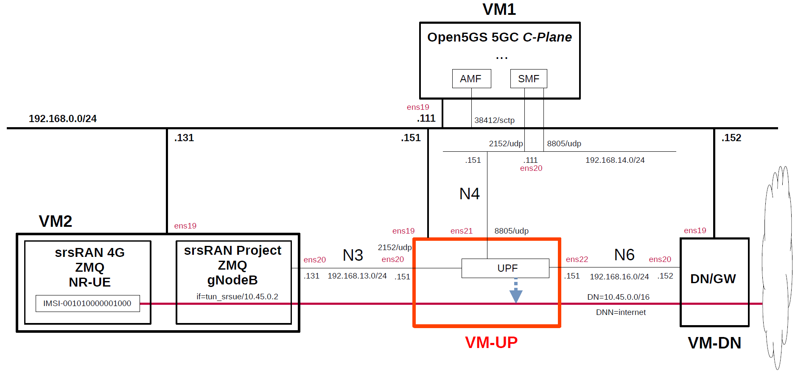

# Simple Measurement of UPF Performance 8
This describes simple performance measurements of several open source UPFs by using [srsRAN_Project](https://github.com/srsran/srsRAN_Project) and [srsRAN_4G](https://github.com/srsran/srsRAN_4G) as the performance measurement tool.
This was measured on the VMs on Proxmox VE.
For other measurement results, please see [Performance Measurement](https://github.com/s5uishida/sample_config_misc_for_mobile_network#performance_measurement).

**Note. Performance measurement results are highly dependent on the measurement conditions. These results are only examples of results under certain measurement conditions.
And this is a very simple measurement, and according to [this comment](https://github.com/open5gs/open5gs/discussions/1780#discussioncomment-10853290), it doesn't seem to make much sense to measure between VMs. I hope it will serve as a reference for a simple configuration when measuring on real devices.**

---

### [Sample Configurations and Miscellaneous for Mobile Network](https://github.com/s5uishida/sample_config_misc_for_mobile_network)

---

<a id="toc"></a>

## Table of Contents

- [Simple Overview of UPF Performance Measurements](#overview)
- [Changes in configuration files of Open5GS, free5GC, UPFs, srsRAN_Project (gNodeB) and srsRAN_4G (NR-UE)](#changes)
  - [Changes in configuration files of Open5GS 5GC C-Plane](#changes_cp_open5gs)
  - [Changes in configuration files of free5GC 5GC C-Plane](#changes_cp_free5gc)
  - [Changes in configuration files of UPFs](#changes_up)
    - [a-1. Changes in configuration files of Open5GS 5GC UPF (TUN)](#changes_up_a1)
    - [a-2. Changes in configuration files of Open5GS 5GC UPF (TAP)](#changes_up_a2)
    - [b. Changes in configuration files of free5GC 5GC UPF](#changes_up_b)
    - [c. Changes in configuration files of UPG-VPP](#changes_up_c)
    - [d. Changes in configuration files of eUPF](#changes_up_d)
  - [Changes in configuration files of srsRAN_Project (gNodeB)](#changes_gnb)
  - [Changes in configuration files of srsRAN_4G (NR-UE)](#changes_ue)
- [Network settings of UPFs and Data Network Gateway](#network_settings)
  - [a-1. Network settings of Open5GS 5GC UPF (TUN)](#network_settings_up_a1)
  - [a-2. Network settings of Open5GS 5GC UPF (TAP)](#network_settings_up_a2)
  - [b. Network settings of free5GC 5GC UPF](#network_settings_up_b)
  - [c. Network settings of UPG-VPP](#network_settings_up_c)
  - [d. Network settings of eUPF](#network_settings_up_d)
  - [Network settings of Data Network Gateway](#network_settings_dn)
- [Build Open5GS, free5GC, UPFs, srsRAN_Project (gNodeB) and srsRAN_4G (NR-UE)](#build)
- [Run Open5GS, free5GC and UPFs](#run)
  - [Run UPFs](#run_up)
    - [a-1. Run Open5GS 5GC UPF (TUN)](#run_up_a1)
    - [a-2. Run Open5GS 5GC UPF (TAP)](#run_up_a2)
    - [b. Run free5GC 5GC UPF](#run_up_b)
    - [c. Run UPG-VPP](#run_up_c)
    - [d. Run eUPF](#run_up_d)
  - [Run 5GC C-Plane](#run_cp)
    - [Run Open5GS 5GC C-Plane](#run_cp_open5gs)
    - [Run free5GC 5GC C-Plane](#run_cp_free5gc)
- [Measure using srsRAN_Project (gNodeB) and srsRAN_4G (NR-UE)](#measure)
  - [Run srsRAN_Project (gNodeB) and srsRAN_4G (NR-UE) on VM2](#run_srsran)
  - [Run iPerf3 server on Data Network Gateway (VM-DN)](#run_iperf3_server)
  - [Try iPerf3 client on VM2](#try_ping_iperf3)
- [Results](#results)
  - [Summary](#summary)
  - [Performance of N6 interface only](#n6_performance)
- [Changelog (summary)](#changelog)

---

<a id="overview"></a>

## Simple Overview of UPF Performance Measurements

Using Open5GS for 5GC, I will easily measure the performance of several open source UPFs with srsRAN_Project and srsRAN_4G.
**Note that this configuration is implemented with Proxmox VE VMs.**

The following minimum configuration was set as a condition.
- Only one each for C-Plane, U-Plane(UPF) and RAN&UE.

The built simulation environment is as follows.

</img>

The 5GC / RAN&UE used are as follows.

- 5GC - Open5GS v2.7.2 (2025.01.12) - https://github.com/open5gs/open5gs  
  *for Open5GS UPF, UPG-VPP and eUPF*
- 5GC - free5GC v3.4.4 (2025.01.03) - https://github.com/free5gc/free5gc  
  *for free5GC UPF (go-upf)*
- RAN - srsRAN_Project 24.10 (2024.12.03) - https://github.com/srsran/srsRAN_Project
- UE - srsRAN_4G 23.11 (2024.02.01) - https://github.com/srsran/srsRAN_4G

The UPFs used are as follows.

- Open5GS v2.7.2 (2025.01.12) - https://github.com/open5gs/open5gs
- free5GC UPF (go-upf) v1.2.4 (2025.01.02) - https://github.com/free5gc/go-upf  
  gtp5g v0.9.8 (2025.01.14) - https://github.com/free5gc/gtp5g
- UPG-VPP v1.13.0 (2024.03.25) - https://github.com/travelping/upg-vpp
- eUPF v0.6.4 (2024.12.23) - https://github.com/edgecomllc/eupf

Each VMs are as follows.
| VM | SW & Role | IP address | OS | CPU | Mem | HDD |
| --- | --- | --- | --- | --- | --- | --- |
| VM1 | Open5GS 5GC C-Plane | 192.168.0.111/24 | Ubuntu 24.04 | 1 | 2GB | 20GB |
| **VM-UP** | **each UPF U-Plane**  | **192.168.0.151/24** | **Ubuntu 24.04<br>or 22.04** | **2** | **8GB** | **20GB** |
| VM-DN | Data Network Gateway  | 192.168.0.152/24 | Ubuntu 24.04 | 2 | 2GB | 10GB |
| VM2 | srsRAN_Project (gNodeB) &<br>srsRAN_4G (NR-UE) | 192.168.0.131/24 | Ubuntu 22.04 | 4 | 6GB | 20GB |

**Each VM-UP(UPFs) are as follows.**
| # | SW | Date | Commit | OS |
| --- | --- | --- | --- | --- |
| a | Open5GS UPF v2.7.2 | 2025.01.12 | `13585a34e3d5505dd86d2cdf78c91829f3936851` | Ubuntu 24.04 |
| b | free5GC UPF<br>(go-upf) v1.2.4 | 2025.01.02 | `88fbd8bb7b86761cbbcf1367acf2df7d81392ce3` | Ubuntu 24.04 |
| c | UPG-VPP v1.13.0 | 2024.03.25 | `dfdf64000566d35955d7c180720ff66086bd3572` | Ubuntu 22.04 |
| d | eUPF v0.6.4 | 2024.12.23 | `307b80aec8c7bc8fa376e03927c2f5c55a1fd687` | Ubuntu 24.04 |

The network interfaces of each VM except VM-UP are as follows.
| VM | Device | Model | Linux Bridge | IP address | Interface |
| --- | --- | --- | --- | --- | --- |
| VM1 | ens18 | VirtIO | vmbr1 | 10.0.0.111/24 | (NAPT NW) |
| | ens19 | VirtIO | mgbr0 | 192.168.0.111/24 | (Mgmt NW) |
| | ens20 | VirtIO | vmbr4 | 192.168.14.111/24 | N4 |
| VM-DN | ens18 | VirtIO | vmbr1 | 10.0.0.152/24 | (NAPT NW) |
| | ens19 | VirtIO | mgbr0 | 192.168.0.152/24 | (Mgmt NW) |
| | ens20 | VirtIO | vmbr6 | 192.168.16.152/24 | N6 ***(default GW for VM-UP)*** |
| VM2 | ens18 | VirtIO | vmbr1 | 10.0.0.131/24 | (NAPT NW) |
| | ens19 | VirtIO | mgbr0 | 192.168.0.131/24 | (Mgmt NW) |
| | ens20 | VirtIO | vmbr3 | 192.168.13.131/24 | N3 |

**The network interfaces of each VM-UP(UPFs) are as follows.**
**Note that UPFs other than `b` connect to the Open5GS CN, but `b` free5GC UPF does not support FTUP flag in PFCP Association Setup Request/Respose, so it connects to free5GC CN.**
| # | SW | Device | Model | Linux Bridge | IP address | Interface |
| --- | --- | --- | --- | --- | --- | --- |
| a | Open5GS UPF | ~~ens18~~ | ~~VirtIO~~ | ~~vmbr1~~ | ~~10.0.0.151/24~~ | ~~(NAPT NW)~~ ***down*** |
| | | ens19 | VirtIO | mgbr0 | 192.168.0.151/24 | (Mgmt NW) |
| | | ens20 | VirtIO | vmbr3 | 192.168.13.151/24 | N3 |
| | | ens21 | VirtIO | vmbr4 | 192.168.14.151/24 | N4 |
| | | ens22 | VirtIO | vmbr6 | 192.168.16.151/24 | N6 |
| b | free5GC UPF<br>(go-upf) | ~~ens18~~ | ~~VirtIO~~ | ~~vmbr1~~ | ~~10.0.0.151/24~~ | ~~(NAPT NW)~~ ***down*** |
| | | ens19 | VirtIO | mgbr0 | 192.168.0.151/24 | (Mgmt NW) |
| | | ens20 | VirtIO | vmbr3 | 192.168.13.151/24 | N3 |
| | | ens21 | VirtIO | vmbr4 | 192.168.14.151/24 | N4 |
| | | ens22 | VirtIO | vmbr6 | 192.168.16.151/24 | N6 |
| c | UPG-VPP | ens18 | VirtIO | vmbr1 | 10.0.0.151/24 | (NAPT NW) |
| | | ens19 | VirtIO | mgbr0 | 192.168.0.151/24 | (Mgmt NW) |
| | | ens20 | VirtIO | vmbr3 | 192.168.13.151/24 | N3 ***(Under DPDK by vfio-pci)*** |
| | | ens21 | VirtIO | vmbr4 | 192.168.14.151/24 | N4 ***(Under DPDK by vfio-pci)*** |
| | | ens22 | VirtIO | vmbr6 | 192.168.16.151/24 | N6 ***(Under DPDK by vfio-pci)*** |
| d | eUPF | ~~ens18~~ | ~~VirtIO~~ | ~~vmbr1~~ | ~~10.0.0.151/24~~ | ~~(NAPT NW)~~ ***down*** |
| | | ens19 | VirtIO | mgbr0 | 192.168.0.151/24 | (Mgmt NW) |
| | | ens20 | VirtIO | vmbr3 | 192.168.13.151/24 | N3 ***(XDP)*** |
| | | ens21 | VirtIO | vmbr4 | 192.168.14.151/24 | N4 |
| | | ens22 | VirtIO | vmbr6 | 192.168.16.151/24 | N6 ***(XDP)*** |

Linux Bridges of Proxmox VE are as follows.
| Linux Bridge | Network CIDR | Interface |
| --- | --- | --- |
| vmbr1 | 10.0.0.0/24 | NAPT NW |
| mgbr0 | 192.168.0.0/24 | Mgmt NW |
| vmbr3 | 192.168.13.0/24 | N3 |
| vmbr4 | 192.168.14.0/24 | N4 |
| vmbr6 | 192.168.16.0/24 | N6 |

The main subscriber Information is as follows.
Please register the subscriber information on each WebConsole of Open5GS and free5GC.
| IMSI | DNN | DN | Key & OPc | S-NSSAI |
| --- | --- | --- | --- | --- |
| 001010000001000 | internet | 10.45.0.0/16 | `Key:465B5CE8B199B49FAA5F0A2EE238A6BC`<br>`OPc:E8ED289DEBA952E4283B54E88E6183CA` | SST:1<br>SD:010203|

The main information of gNodeB is as follows.
| MCC | MNC | TAC | gNodeB ID |
| --- | --- | --- | --- |
| 001 | 01 | 1 | 0x19b |

<a id="changes"></a>

## Changes in configuration files of Open5GS, free5GC, UPFs, srsRAN_Project (gNodeB) and srsRAN_4G (NR-UE)

Please refer to the following for building Open5GS, free5GC, UPFs, srsRAN_Project (gNodeB) and srsRAN_4G (NR-UE) respectively.
- Open5GS v2.7.2 (2025.01.12) - https://open5gs.org/open5gs/docs/guide/02-building-open5gs-from-sources/
- free5GC v3.4.4 (2025.01.03) - https://free5gc.org/guide/
- free5GC UPF (go-upf) v1.2.4 (2025.01.02) - https://free5gc.org/guide/
- UPG-VPP v1.13.0 (2024.03.25) - https://github.com/s5uishida/install_vpp_upf_dpdk#annex_1
- eUPF v0.6.4 (2024.12.23) - https://github.com/s5uishida/install_eupf
- srsRAN_Project 24.10 (2024.12.03) - https://github.com/s5uishida/build_srsran_5g_zmq
- srsRAN_4G 23.11 (2024.02.01) - https://github.com/s5uishida/build_srsran_4g_zmq_disable_rf_plugins

<a id="changes_cp_open5gs"></a>

### Changes in configuration files of Open5GS 5GC C-Plane

- `open5gs/install/etc/open5gs/amf.yaml`
```diff
--- amf.yaml.orig       2025-01-15 04:12:06.000000000 +0900
+++ amf.yaml    2025-01-15 04:22:37.621726917 +0900
@@ -20,29 +20,32 @@
         - uri: http://127.0.0.200:7777
   ngap:
     server:
-      - address: 127.0.0.5
+      - address: 192.168.0.111
   metrics:
     server:
       - address: 127.0.0.5
         port: 9090
   guami:
     - plmn_id:
-        mcc: 999
-        mnc: 70
+        mcc: 001
+        mnc: 01
       amf_id:
         region: 2
         set: 1
   tai:
     - plmn_id:
-        mcc: 999
-        mnc: 70
+        mcc: 001
+        mnc: 01
       tac: 1
   plmn_support:
     - plmn_id:
-        mcc: 999
-        mnc: 70
+        mcc: 001
+        mnc: 01
       s_nssai:
         - sst: 1
+          sd: 1
+        - sst: 1
+          sd: 010203
   security:
     integrity_order : [ NIA2, NIA1, NIA0 ]
     ciphering_order : [ NEA0, NEA1, NEA2 ]
```
- `open5gs/install/etc/open5gs/nrf.yaml`
```diff
--- nrf.yaml.orig       2025-01-15 04:12:06.000000000 +0900
+++ nrf.yaml    2025-01-15 04:22:49.084577534 +0900
@@ -11,8 +11,8 @@
 nrf:
   serving:  # 5G roaming requires PLMN in NRF
     - plmn_id:
-        mcc: 999
-        mnc: 70
+        mcc: 001
+        mnc: 01
   sbi:
     server:
       - address: 127.0.0.10
```
- `open5gs/install/etc/open5gs/smf.yaml`
```diff
--- smf.yaml.orig       2025-01-15 04:12:06.000000000 +0900
+++ smf.yaml    2025-01-15 04:26:52.389445171 +0900
@@ -7,6 +7,8 @@
   max:
     ue: 1024  # The number of UE can be increased depending on memory size.
 #    peer: 64
+  parameter:
+    use_upg_vpp: true
 
 smf:
   sbi:
@@ -20,16 +22,14 @@
         - uri: http://127.0.0.200:7777
   pfcp:
     server:
-      - address: 127.0.0.4
+      - address: 192.168.14.111
     client:
       upf:
-        - address: 127.0.0.7
-  gtpc:
-    server:
-      - address: 127.0.0.4
+        - address: 192.168.14.151
+          dnn: internet
   gtpu:
     server:
-      - address: 127.0.0.4
+      - address: 192.168.14.111
   metrics:
     server:
       - address: 127.0.0.4
@@ -37,20 +37,17 @@
   session:
     - subnet: 10.45.0.0/16
       gateway: 10.45.0.1
-    - subnet: 2001:db8:cafe::/48
-      gateway: 2001:db8:cafe::1
+      dnn: internet
   dns:
     - 8.8.8.8
     - 8.8.4.4
-    - 2001:4860:4860::8888
-    - 2001:4860:4860::8844
   mtu: 1400
 #  p-cscf:
 #    - 127.0.0.1
 #    - ::1
 #  ctf:
 #    enabled: auto   # auto(default)|yes|no
-  freeDiameter: /root/open5gs/install/etc/freeDiameter/smf.conf
+#  freeDiameter: /root/open5gs/install/etc/freeDiameter/smf.conf
 
 ################################################################################
 # SMF Info
```

<a id="changes_cp_free5gc"></a>

### Changes in configuration files of free5GC 5GC C-Plane

- `free5gc/config/amfcfg.yaml`
```diff
--- amfcfg.yaml.orig    2024-10-14 05:09:24.379203731 +0900
+++ amfcfg.yaml 2024-10-14 05:59:21.011914287 +0900
@@ -5,7 +5,7 @@
 configuration:
   amfName: AMF # the name of this AMF
   ngapIpList:  # the IP list of N2 interfaces on this AMF
-    - 127.0.0.18
+    - 192.168.0.111
   ngapPort: 38412 # the SCTP port listened by NGAP
 
   # Service-based Interface (SBI) Configuration
@@ -30,22 +30,22 @@
   servedGuamiList:
     # <GUAMI> = <MCC><MNC><AMF ID>
     - plmnId: # Public Land Mobile Network ID, <PLMN ID> = <MCC><MNC>
-        mcc: 208 # Mobile Country Code (3 digits string, digit: 0~9)
-        mnc: 93 # Mobile Network Code (2 or 3 digits string, digit: 0~9)
+        mcc: 001 # Mobile Country Code (3 digits string, digit: 0~9)
+        mnc: 01 # Mobile Network Code (2 or 3 digits string, digit: 0~9)
       amfId: cafe00 # AMF identifier (3 bytes hex string, range: 000000~FFFFFF)
 
   # the TAI (Tracking Area Identifier) list supported by this AMF
   supportTaiList:
     - plmnId: # Public Land Mobile Network ID, <PLMN ID> = <MCC><MNC>
-        mcc: 208 # Mobile Country Code (3 digits string, digit: 0~9)
-        mnc: 93 # Mobile Network Code (2 or 3 digits string, digit: 0~9)
+        mcc: 001 # Mobile Country Code (3 digits string, digit: 0~9)
+        mnc: 01 # Mobile Network Code (2 or 3 digits string, digit: 0~9)
       tac: 000001 # Tracking Area Code (3 bytes hex string, range: 000000~FFFFFF)
 
   # the PLMNs (Public land mobile network) list supported by this AMF
   plmnSupportList:
     - plmnId: # Public Land Mobile Network ID, <PLMN ID> = <MCC><MNC>
-        mcc: 208 # Mobile Country Code (3 digits string, digit: 0~9)
-        mnc: 93 # Mobile Network Code (2 or 3 digits string, digit: 0~9)
+        mcc: 001 # Mobile Country Code (3 digits string, digit: 0~9)
+        mnc: 01 # Mobile Network Code (2 or 3 digits string, digit: 0~9)
       snssaiList: # the S-NSSAI (Single Network Slice Selection Assistance Information) list supported by this AMF
         - sst: 1 # Slice/Service Type (uinteger, range: 0~255)
           sd: 010203 # Slice Differentiator (3 bytes hex string, range: 000000~FFFFFF)
```
- `free5gc/config/ausfcfg.yaml`
```diff
--- ausfcfg.yaml.orig   2024-09-01 09:47:28.519041774 +0900
+++ ausfcfg.yaml        2024-09-01 09:55:53.372615743 +0900
@@ -16,10 +16,8 @@
   nrfUri: http://127.0.0.10:8000 # a valid URI of NRF
   nrfCertPem: cert/nrf.pem # NRF Certificate
   plmnSupportList: # the PLMNs (Public Land Mobile Network) list supported by this AUSF
-    - mcc: 208 # Mobile Country Code (3 digits string, digit: 0~9)
-      mnc: 93  # Mobile Network Code (2 or 3 digits string, digit: 0~9)
-    - mcc: 123 # Mobile Country Code (3 digits string, digit: 0~9)
-      mnc: 45  # Mobile Network Code (2 or 3 digits string, digit: 0~9)
+    - mcc: 001 # Mobile Country Code (3 digits string, digit: 0~9)
+      mnc: 01  # Mobile Network Code (2 or 3 digits string, digit: 0~9)
   groupId: ausfGroup001 # ID for the group of the AUSF
   eapAkaSupiImsiPrefix: false # including "imsi-" prefix or not when using the SUPI to do EAP-AKA' authentication
 
```
- `free5gc/config/nrfcfg.yaml`
```diff
--- nrfcfg.yaml.orig    2024-09-01 09:47:28.520041774 +0900
+++ nrfcfg.yaml 2024-09-01 09:56:09.974381863 +0900
@@ -18,8 +18,8 @@
       key: cert/root.key
     oauth: true
   DefaultPlmnId:
-    mcc: 208 # Mobile Country Code (3 digits string, digit: 0~9)
-    mnc: 93 # Mobile Network Code (2 or 3 digits string, digit: 0~9)
+    mcc: 001 # Mobile Country Code (3 digits string, digit: 0~9)
+    mnc: 01 # Mobile Network Code (2 or 3 digits string, digit: 0~9)
   serviceNameList: # the SBI services provided by this NRF, refer to TS 29.510
     - nnrf-nfm # Nnrf_NFManagement service
     - nnrf-disc # Nnrf_NFDiscovery service
```
- `free5gc/config/nssfcfg.yaml`
```diff
--- nssfcfg.yaml.orig   2024-09-01 09:47:28.521041774 +0900
+++ nssfcfg.yaml        2024-09-01 09:56:46.775178233 +0900
@@ -18,12 +18,12 @@
   nrfUri: http://127.0.0.10:8000 # a valid URI of NRF
   nrfCertPem: cert/nrf.pem # NRF Certificate
   supportedPlmnList: # the PLMNs (Public land mobile network) list supported by this NSSF
-    - mcc: 208 # Mobile Country Code (3 digits string, digit: 0~9)
-      mnc: 93 # Mobile Network Code (2 or 3 digits string, digit: 0~9)
+    - mcc: 001 # Mobile Country Code (3 digits string, digit: 0~9)
+      mnc: 01 # Mobile Network Code (2 or 3 digits string, digit: 0~9)
   supportedNssaiInPlmnList: # Supported S-NSSAI List for each PLMN
     - plmnId: # Public Land Mobile Network ID, <PLMN ID> = <MCC><MNC>
-        mcc: 208 # Mobile Country Code (3 digits string, digit: 0~9)
-        mnc: 93 # Mobile Network Code (2 or 3 digits string, digit: 0~9)
+        mcc: 001 # Mobile Country Code (3 digits string, digit: 0~9)
+        mnc: 01 # Mobile Network Code (2 or 3 digits string, digit: 0~9)
       supportedSnssaiList: # Supported S-NSSAIs of the PLMN
         - sst: 1 # Slice/Service Type (uinteger, range: 0~255)
           sd: 010203 # Slice Differentiator (3 bytes hex string, range: 000000~FFFFFF)
```
- `free5gc/config/smfcfg.yaml`
```diff
--- smfcfg.yaml.orig    2024-10-14 05:09:24.379203731 +0900
+++ smfcfg.yaml 2024-10-14 06:03:45.294139455 +0900
@@ -42,16 +42,16 @@
 
   # Optional: PLMN IDs configuration.
   plmnList:
-    - mcc: 208 # Mobile Country Code (3 digits string, digit: 0~9)
-      mnc: 93 # Mobile Network Code (2 or 3 digits string, digit: 0~9)
+    - mcc: 001 # Mobile Country Code (3 digits string, digit: 0~9)
+      mnc: 01 # Mobile Network Code (2 or 3 digits string, digit: 0~9)
   locality: area1 # Name of the location where a set of AMF, SMF, PCF and UPFs are located
 
   # PFCP (Packet Forwarding Control Protocol) configuration for N4 interface.
   pfcp:
     # addr config is deprecated in smf config v1.0.3, please use the following config
-    nodeID: 127.0.0.1 # the Node ID of this SMF
-    listenAddr: 127.0.0.1 # the IP/FQDN of N4 interface on this SMF (PFCP)
-    externalAddr: 127.0.0.1 # the IP/FQDN of N4 interface on this SMF (PFCP)
+    nodeID: 192.168.14.111 # the Node ID of this SMF
+    listenAddr: 192.168.14.111 # the IP/FQDN of N4 interface on this SMF (PFCP)
+    externalAddr: 192.168.14.111 # the IP/FQDN of N4 interface on this SMF (PFCP)
     assocFailAlertInterval: 10s
     assocFailRetryInterval: 30s
     heartbeatInterval: 10s
@@ -63,8 +63,8 @@
         type: AN # the type of the node (AN or UPF)
       UPF: # the name of the node
         type: UPF # the type of the node (AN or UPF)
-        nodeID: 127.0.0.8 # the Node ID of this UPF
-        addr: 127.0.0.8 # the IP/FQDN of N4 interface on this UPF (PFCP)
+        nodeID: 192.168.14.151 # the Node ID of this UPF
+        addr: 192.168.14.151 # the IP/FQDN of N4 interface on this UPF (PFCP)
         sNssaiUpfInfos: # S-NSSAI information list for this UPF
           - sNssai: # S-NSSAI (Single Network Slice Selection Assistance Information)
               sst: 1 # Slice/Service Type (uinteger, range: 0~255)
@@ -72,9 +72,9 @@
             dnnUpfInfoList: # DNN information list for this S-NSSAI
               - dnn: internet
                 pools:
-                  - cidr: 10.60.0.0/16
+                  - cidr: 10.45.0.0/16
                 staticPools:
-                  - cidr: 10.60.100.0/24
+                  - cidr: 10.45.100.0/24
           - sNssai: # S-NSSAI (Single Network Slice Selection Assistance Information)
               sst: 1 # Slice/Service Type (uinteger, range: 0~255)
               sd: 112233 # Slice Differentiator (3 bytes hex string, range: 000000~FFFFFF)
@@ -91,7 +91,7 @@
         interfaces: # Interface list for this UPF
           - interfaceType: N3 # the type of the interface (N3 or N9)
             endpoints: # the IP address of this N3/N9 interface on this UPF
-              - 127.0.0.8
+              - 192.168.13.151
             networkInstances: # Data Network Name (DNN)
               - internet
 
@@ -99,7 +99,8 @@
     links:
       - A: gNB1
         B: UPF
-
+  ulcl: false
+  nwInstFqdnEncoding: true
   # retransmission timer for PDU session modification command
   t3591:
     enable: true # true or false
```

<a id="changes_up"></a>

### Changes in configuration files of UPFs

<a id="changes_up_a1"></a>

#### a-1. Changes in configuration files of Open5GS 5GC UPF (TUN)

- `open5gs/install/etc/open5gs/upf.yaml`
```diff
--- upf.yaml.orig       2024-05-02 19:52:00.000000000 +0900
+++ upf.yaml        2024-05-19 12:38:00.000000000 +0900
@@ -11,18 +11,18 @@
 upf:
   pfcp:
     server:
-      - address: 127.0.0.7
+      - address: 192.168.14.151
     client:
 #      smf:     #  UPF PFCP Client try to associate SMF PFCP Server
 #        - address: 127.0.0.4
   gtpu:
     server:
-      - address: 127.0.0.7
+      - address: 192.168.13.151
   session:
     - subnet: 10.45.0.0/16
       gateway: 10.45.0.1
-    - subnet: 2001:db8:cafe::/48
-      gateway: 2001:db8:cafe::1
+      dnn: internet
+      dev: ogstun
   metrics:
     server:
       - address: 127.0.0.7
```

<a id="changes_up_a2"></a>

#### a-2. Changes in configuration files of Open5GS 5GC UPF (TAP)

- `open5gs/install/etc/open5gs/upf.yaml`
```diff
--- upf.yaml.orig       2024-05-02 19:52:00.000000000 +0900
+++ upf.yaml        2024-09-23 14:00:20.724467385 +0900
@@ -11,18 +11,18 @@
 upf:
   pfcp:
     server:
-      - address: 127.0.0.7
+      - address: 192.168.14.151
     client:
 #      smf:     #  UPF PFCP Client try to associate SMF PFCP Server
 #        - address: 127.0.0.4
   gtpu:
     server:
-      - address: 127.0.0.7
+      - address: 192.168.13.151
   session:
     - subnet: 10.45.0.0/16
       gateway: 10.45.0.1
-    - subnet: 2001:db8:cafe::/48
-      gateway: 2001:db8:cafe::1
+      dnn: internet
+      dev: ogstap
   metrics:
     server:
       - address: 127.0.0.7
```

<a id="changes_up_b"></a>

#### b. Changes in configuration files of free5GC 5GC UPF

- `go-upf/upfcfg.yaml`
```diff
--- upfcfg.yaml.orig    2024-10-14 04:53:12.341028732 +0900
+++ upfcfg.yaml 2024-10-14 06:11:36.636303534 +0900
@@ -4,8 +4,8 @@
 # PFCP Configuration
 # The listen IP and nodeID of the N4 interface on this UPF (Can't set to 0.0.0.0)
 pfcp:
-  addr: 127.0.0.8   # IP addr for listening
-  nodeID: 127.0.0.8 # External IP or FQDN can be reached
+  addr: 192.168.14.151   # IP addr for listening
+  nodeID: 192.168.14.151 # External IP or FQDN can be reached
   retransTimeout: 1s # retransmission timeout
   maxRetrans: 3 # the max number of retransmission
 
@@ -18,7 +18,7 @@
   # If you bind to a specific IP, ensure SMF uses the same IP in its N3 configuration.
   # If you bind to all (0.0.0.0), SMF can use any of the available UPF IPs, but do not use 0.0.0.0 in SMF.
   ifList:
-    - addr: 127.0.0.8
+    - addr: 192.168.13.151
       type: N3
       # name: upf.5gc.nctu.me
       # ifname: gtpif
@@ -28,9 +28,7 @@
 # List of Data Network Names (DNN) supported by this UPF.
 dnnList:
   - dnn: internet # Data Network Name
-    cidr: 10.60.0.0/16 # Classless Inter-Domain Routing for assigned IPv4 pool of UE
-  - dnn: internet # Data Network Name
-    cidr: 10.61.0.0/16 # Classless Inter-Domain Routing for assigned IPv4 pool of UE
+    cidr: 10.45.0.0/16 # Classless Inter-Domain Routing for assigned IPv4 pool of UE
     # natifname: eth0
 
 # Logging Configuration
```

<a id="changes_up_c"></a>

#### c. Changes in configuration files of UPG-VPP

See [here](https://github.com/s5uishida/install_vpp_upf_dpdk#changes_up) for the original files.

- `openair-upf/startup.conf`  
There is no change.

- `openair-upf/init.conf`  
There is no change.

<a id="changes_up_d"></a>

#### d. Changes in configuration files of eUPF

See [here](https://github.com/s5uishida/install_eupf#create-configuration-file) for the original file.

- `eupf/config.yml`  
There is no change.

<a id="changes_gnb"></a>

### Changes in configuration files of srsRAN_Project (gNodeB)

See [here](https://github.com/s5uishida/build_srsran_5g_zmq#create-the-configuration-file-of-gnodeb) for the original files.

- `srsRAN_Project/build/apps/gnb/gnb_zmq.yaml`
```diff
--- gnb_zmq.yaml.orig   2024-12-17 22:40:54.000000000 +0900
+++ gnb_zmq.yaml        2024-12-20 20:46:05.339035909 +0900
@@ -3,17 +3,29 @@
 # To run the srsRAN Project gNB with this config, use the following command: 
 #   sudo ./gnb -c gnb_zmq.yaml
 
+gnb_id: 0x19B
+
+cu_up:
+  upf:
+    bind_addr: 192.168.13.131             # Optional TEXT. Sets local IP address to bind for N3 interface. Format: IPV4 or IPV6 IP address.
+    bind_interface: ens20                 # Optional TEXT. Sets network device to bind for N3 interface. Format: IPV4 or IPV6 IP address.
+    ext_addr: auto                        # Optional TEXT. Sets external IP address that is advertised to receive GTP-U packets from UPF via N3 interface. Format: IPV4 or IPV6 IP address.
+    udp_max_rx_msgs: 256                  # Optional INT. Sets the maximum amount of messages RX in a single syscall.
+    pool_threshold: 0.9                   # Optional FLOAT. Sets the pool accupancy threshold after which packets are dropped. Supported: [0.0 - 1.0].
+    no_core: false                        # Optional BOOLEAN. Setting to true allows the gNB to run without a core. Supported: [0, 1].
+
 cu_cp:
   amf:
-    addr: 10.53.1.2                 # The address or hostname of the AMF.
+    addr: 192.168.0.111                 # The address or hostname of the AMF.
     port: 38412
-    bind_addr: 10.53.1.1            # A local IP that the gNB binds to for traffic from the AMF.
+    bind_addr: 192.168.0.131            # A local IP that the gNB binds to for traffic from the AMF.
     supported_tracking_areas:
-      - tac: 7
+      - tac: 1
         plmn_list:
           - plmn: "00101"
             tai_slice_support_list:
               - sst: 1
+                sd: 66051
   inactivity_timer: 7200            # Sets the UE/PDU Session/DRB inactivity timer to 7200 seconds. Supported: [1 - 7200].
 
 ru_sdr:
@@ -29,7 +41,7 @@
   channel_bandwidth_MHz: 20         # Bandwith in MHz. Number of PRBs will be automatically derived.
   common_scs: 15                    # Subcarrier spacing in kHz used for data.
   plmn: "00101"                     # PLMN broadcasted by the gNB.
-  tac: 7                            # Tracking area code (needs to match the core configuration).
+  tac: 1                            # Tracking area code (needs to match the core configuration).
   pdcch:
     common:
       ss0_index: 0                  # Set search space zero index to match srsUE capabilities
```

<a id="changes_ue"></a>

### Changes in configuration files of srsRAN_4G (NR-UE)

See [here](https://github.com/s5uishida/build_srsran_4g_zmq_disable_rf_plugins#create-the-configuration-file-of-nr-ue) for the original files.

- `srsRAN_4G/build/srsue/ue_zmq.conf`
```diff
--- ue_zmq.conf.orig    2023-12-07 03:04:58.000000000 +0900
+++ ue_zmq.conf 2024-10-17 20:34:10.000000000 +0900
@@ -34,9 +34,9 @@
 [usim]
 mode = soft
 algo = milenage
-opc  = 63BFA50EE6523365FF14C1F45F88737D
-k    = 00112233445566778899aabbccddeeff
-imsi = 001010123456780
+opc  = E8ED289DEBA952E4283B54E88E6183CA
+k    = 465B5CE8B199B49FAA5F0A2EE238A6BC
+imsi = 001010000001000
 imei = 353490069873319
 
 [rrc]
@@ -44,11 +44,16 @@
 ue_category = 4
 
 [nas]
-apn = srsapn
+apn = internet
 apn_protocol = ipv4
 
+[slicing]
+enable = true
+nssai-sst = 1
+nssai-sd = 66051
+
 [gw]
-netns = ue1
+#netns = ue1
 ip_devname = tun_srsue
 ip_netmask = 255.255.255.0
 
```

<a id="network_settings"></a>

## Network settings of UPFs and Data Network Gateway

<a id="network_settings_up_a1"></a>

### a-1. Network settings of Open5GS 5GC UPF (TUN)

First, uncomment the next line in the `/etc/sysctl.conf` file and reflect it in the OS.
```
net.ipv4.ip_forward=1
```
```
# sysctl -p
```
Next, down the interface `ens18` of the VM-UP and set the VM-DN IP address to default GW on the N6 interface`ens22`.
```
# ip link set dev ens18 down
# ip route add default via 192.168.16.152 dev ens22
```
Then, configure the TUNnel interface.
```
# ip tuntap add name ogstun mode tun
# ip addr add 10.45.0.1/16 dev ogstun
# ip link set ogstun up
```

<a id="network_settings_up_a2"></a>

### a-2. Network settings of Open5GS 5GC UPF (TAP)

First, uncomment the next line in the `/etc/sysctl.conf` file and reflect it in the OS.
```
net.ipv4.ip_forward=1
```
```
# sysctl -p
```
Next, down the interface `ens18` of the VM-UP and set the VM-DN IP address to default GW on the N6 interface`ens22`.
```
# ip link set dev ens18 down
# ip route add default via 192.168.16.152 dev ens22
```
Then, configure the TAP interface.
```
# ip tuntap add name ogstap mode tap
# ip addr add 10.45.0.1/16 dev ogstap
# ip link set ogstap up
```

<a id="network_settings_up_b"></a>

### b. Network settings of free5GC 5GC UPF

First, uncomment the next line in the `/etc/sysctl.conf` file and reflect it in the OS.
```
net.ipv4.ip_forward=1
```
```
# sysctl -p
```
Next, down the interface `ens18` of the VM-UP and set the VM-DN IP address to default GW on the N6 interface`ens22`.
```
# ip link set dev ens18 down
# ip route add default via 192.168.16.152 dev ens22
```

<a id="network_settings_up_c"></a>

### c. Network settings of UPG-VPP

See [this](https://github.com/s5uishida/install_vpp_upf_dpdk#setup_up).

<a id="network_settings_up_d"></a>

### d. Network settings of eUPF

First, uncomment the next line in the `/etc/sysctl.conf` file and reflect it in the OS.
```
net.ipv4.ip_forward=1
```
```
# sysctl -p
```
Next, down the interface `ens18` of the VM-UP and set the VM-DN IP address to default GW on the N6 interface`ens22`.
```
# ip link set dev ens18 down
# ip route add default via 192.168.16.152 dev ens22
```

<a id="network_settings_dn"></a>

### Network settings of Data Network Gateway

First, uncomment the next line in the `/etc/sysctl.conf` file and reflect it in the OS.
```
net.ipv4.ip_forward=1
```
```
# sysctl -p
```
Next, configure NAPT and routing to N6 IP address of UPF.
```
# iptables -t nat -A POSTROUTING -s 10.45.0.0/16 -j MASQUERADE
# ip route add 10.45.0.0/16 via 192.168.16.151 dev ens20
```

<a id="build"></a>

## Build Open5GS, free5GC, UPFs, srsRAN_Project (gNodeB) and srsRAN_4G (NR-UE)

Please refer to the following for building Open5GS, free5GC, UPFs, srsRAN_Project (gNodeB) and srsRAN_4G (NR-UE) respectively.
- Open5GS v2.7.2 (2025.01.12) - https://open5gs.org/open5gs/docs/guide/02-building-open5gs-from-sources/
- free5GC v3.4.4 (2025.01.03) - https://free5gc.org/guide/
- free5GC UPF (go-upf) v1.2.4 (2025.01.02) - https://github.com/s5uishida/install_goupf
- UPG-VPP v1.13.0 (2024.03.25) - https://github.com/s5uishida/install_vpp_upf_dpdk#annex_1
- eUPF v0.6.4 (2024.12.23) - https://github.com/s5uishida/install_eupf
- srsRAN_Project 24.10 (2024.12.03) - https://github.com/s5uishida/build_srsran_5g_zmq
- srsRAN_4G 23.11 (2024.02.01) - https://github.com/s5uishida/build_srsran_4g_zmq_disable_rf_plugins

Install MongoDB on Open5GS and free5GC C-Plane machines.
[MongoDB Compass](https://www.mongodb.com/products/compass) is a convenient tool to look at the MongoDB database.

<a id="run"></a>

## Run Open5GS, free5GC and UPFs

First run each UPF, then each 5GC.
Each UPF uses the same IP address, so start only the UPF you want to measure.

<a id="run_up"></a>

### Run UPFs

<a id="run_up_a1"></a>

#### a-1. Run Open5GS 5GC UPF (TUN)

Please use the configuration files changed for TUN interface.
```
# cd open5gs
# ./install/bin/open5gs-upfd
```

<a id="run_up_a2"></a>

#### a-2. Run Open5GS 5GC UPF (TAP)

Please use the configuration files changed for TAP interface.
```
# cd open5gs
# ./install/bin/open5gs-upfd
```

<a id="run_up_b"></a>

#### b. Run free5GC 5GC UPF

```
# cd go-upf
# ./upf -c upfcfg.yaml
```

<a id="run_up_c"></a>

#### c. Run UPG-VPP

See [this](https://github.com/s5uishida/install_vpp_upf_dpdk#run_upg_vpp).

<a id="run_up_d"></a>

#### d. Run eUPF

See [this](https://github.com/s5uishida/install_eupf#run).

<a id="run_cp"></a>

### Run 5GC C-Plane

<a id="run_cp_open5gs"></a>

#### Run Open5GS 5GC C-Plane

```
./install/bin/open5gs-nrfd &
sleep 2
./install/bin/open5gs-scpd &
sleep 2
./install/bin/open5gs-amfd &
sleep 2
./install/bin/open5gs-smfd &
./install/bin/open5gs-ausfd &
./install/bin/open5gs-udmd &
./install/bin/open5gs-udrd &
./install/bin/open5gs-pcfd &
./install/bin/open5gs-nssfd &
./install/bin/open5gs-bsfd &
```

<a id="run_cp_free5gc"></a>

#### Run free5GC 5GC C-Plane

Create the following shell script and run it.
```bash
#!/usr/bin/env bash

PID_LIST=()

NF_LIST="nrf amf smf udr pcf udm nssf ausf chf nef"

export GIN_MODE=release

for NF in ${NF_LIST}; do
    ./bin/${NF} &
    PID_LIST+=($!)
    sleep 1
done

function terminate()
{
    sudo kill -SIGTERM ${PID_LIST[${#PID_LIST[@]}-2]} ${PID_LIST[${#PID_LIST[@]}-1]}
    sleep 2
}

trap terminate SIGINT
wait ${PID_LIST}
```

<a id="measure"></a>

## Measure using srsRAN_Project (gNodeB) and srsRAN_4G (NR-UE)

This time, I will measure only one connection by one UE.
First, run srsRAN_Project (gNodeB) and srsRAN_4G (NR-UE) to establish a connection that will be used to measure performance.
Then, start the iperf3 server on the Data Network Gateway and connect to it from an iperf3 client on VM2 to take measurements.

**Note that ping measurements are not performed because the connection between srsRAN_Project (gNodeB) and srsRAN_4G (NR-UE) is via ZeroMQ, and the RTT value cannot be expected.**

<a id="run_srsran"></a>

### Run srsRAN_Project (gNodeB) and srsRAN_4G (NR-UE) on VM2

First, run ssrsRAN_Project (gNodeB) and connect to Open5GS 5GC.
```
# cd ~/srsRAN_Project/build/apps/gnb
# ./gnb -c gnb_zmq.yaml

--== srsRAN gNB (commit e5d5b44b9) ==--

Lower PHY in executor blocking mode.
Cell pci=1, bw=20 MHz, 1T1R, dl_arfcn=368500 (n3), dl_freq=1842.5 MHz, dl_ssb_arfcn=368410, ul_freq=1747.5 MHz

Available radio types: zmq.
N2: Connection to AMF on 192.168.0.111:38412 completed
==== gNB started ===
Type <h> to view help
```
Then, run srsRAN_4G (NR-UE) and connect to Open5GS 5GC.
```
# cd ~/srsRAN_4G/build/srsue
# ./src/srsue ue_zmq.conf
Reading configuration file ue_zmq.conf...

Built in Release mode using commit ec29b0c1f on branch master.

Opening 1 channels in RF device=zmq with args=tx_port=tcp://127.0.0.1:2001,rx_port=tcp://127.0.0.1:2000,base_srate=23.04e6
Supported RF device list: zmq file
CHx base_srate=23.04e6
Current sample rate is 1.92 MHz with a base rate of 23.04 MHz (x12 decimation)
CH0 rx_port=tcp://127.0.0.1:2000
CH0 tx_port=tcp://127.0.0.1:2001
Current sample rate is 23.04 MHz with a base rate of 23.04 MHz (x1 decimation)
Current sample rate is 23.04 MHz with a base rate of 23.04 MHz (x1 decimation)
Waiting PHY to initialize ... done!
Attaching UE...
Random Access Transmission: prach_occasion=0, preamble_index=0, ra-rnti=0x39, tti=334
Random Access Complete.     c-rnti=0x4601, ta=0
RRC Connected
PDU Session Establishment successful. IP: 10.45.0.2
RRC NR reconfiguration successful.
```

<a id="run_iperf3_server"></a>

### Run iPerf3 server on Data Network Gateway (VM-DN)

```
# iperf3 -s
```

<a id="try_ping_iperf3"></a>

### Try iPerf3 client on VM2

Try iperf3 client to the address(`192.168.16.152`) of N6 interface on Data Network Gateway.

e.g.) The UPF used in the measurement below is eUPF v0.6.4.
```
# iperf3 -B 10.45.0.2 -c 192.168.16.152
Connecting to host 192.168.16.152, port 5201
[  5] local 10.45.0.2 port 33947 connected to 192.168.16.152 port 5201
[ ID] Interval           Transfer     Bitrate         Retr  Cwnd
[  5]   0.00-1.00   sec   299 MBytes  2.51 Gbits/sec    0   7.51 MBytes       
[  5]   1.00-2.00   sec   318 MBytes  2.66 Gbits/sec    0   7.51 MBytes       
[  5]   2.00-3.00   sec   311 MBytes  2.61 Gbits/sec    0   7.51 MBytes       
[  5]   3.00-4.00   sec   325 MBytes  2.73 Gbits/sec    0   7.51 MBytes       
[  5]   4.00-5.00   sec   320 MBytes  2.68 Gbits/sec    0   7.51 MBytes       
[  5]   5.00-6.00   sec   315 MBytes  2.64 Gbits/sec    0   7.51 MBytes       
[  5]   6.00-7.00   sec   315 MBytes  2.64 Gbits/sec    0   7.51 MBytes       
[  5]   7.00-8.00   sec   304 MBytes  2.55 Gbits/sec    0   7.51 MBytes       
[  5]   8.00-9.00   sec   306 MBytes  2.57 Gbits/sec    0   7.51 MBytes       
[  5]   9.00-10.00  sec   319 MBytes  2.67 Gbits/sec    0   7.51 MBytes       
- - - - - - - - - - - - - - - - - - - - - - - - -
[ ID] Interval           Transfer     Bitrate         Retr
[  5]   0.00-10.00  sec  3.06 GBytes  2.63 Gbits/sec    0             sender
[  5]   0.00-10.04  sec  3.06 GBytes  2.62 Gbits/sec                  receiver

iperf Done.
```

<a id="results"></a>

## Results

These measurements are the values measured between the IP address `10.45.0.0/16` assigned by srsRAN_Project (gNodeB) and srsRAN_4G (NR-UE) on VM2 and the IP address `192.168.16.152` of the Data Network Gateway N6 interface on VM-DN.
The measurements were taken in the following pattern:

1. `iperf3 -B 10.45.0.2 -c 192.168.16.152` (for free5GC UPF, `-B 10.45.0.1`)  
2. `iperf3 -B 10.45.0.2 -c 192.168.16.152 -u -b 5G` (for free5GC UPF, `-B 10.45.0.1`)<br>**UDP packet loss** is a value measured under deliberate load (5 Gbps) in order to compare performance limits.  
3. free5GC UPF connects to the free5GC CN, not the Open5GS CN.


| # | UPF | Date | TCP[1]<br>throughput | UDP[2]<br>throughput | UDP[2]<br>packet loss |
| --- | --- | --- | --- | --- | --- |
| a-1 | Open5GS UPF v2.7.2 (TUN) | 2025.01.12 | S:2.57 Gbps<br>R:2.56 Gbps | S:1.92 Gbps<br>R:1.80 Gbps | 6.2 % |
| a-2 | Open5GS UPF v2.7.2 (TAP) | 2025.01.12 | S:2.58 Gbps<br>R:2.57 Gbps | S:1.98 Gbps<br>R:1.88 Gbps | 5 % |
| b | **free5GC UPF v1.2.4[3]** | 2025.01.02 | S:2.63 Gbps<br>R:2.62 Gbps | S:1.99 Gbps<br>R:1.85 Gbps | 7 % |
| c | UPG-VPP v1.13.0 | 2024.03.25 | S:2.49 Gbps<br>R:2.49 Gbps | S:1.42 Gbps<br>R:1.23 Gbps | 13 % |
| d | eUPF v0.6.4 (native mode) | 2024.12.23 | S:2.63 Gbps<br>R:2.62 Gbps | S:1.87 Gbps<br>R:1.78 Gbps | 4.9 % |

<details><summary>a-1. Ping and iPerf3 logs for Open5GS UPF v2.7.2 (TUN)</summary>

```
# iperf3 -B 10.45.0.2 -c 192.168.16.152
Connecting to host 192.168.16.152, port 5201
[  5] local 10.45.0.2 port 46995 connected to 192.168.16.152 port 5201
[ ID] Interval           Transfer     Bitrate         Retr  Cwnd
[  5]   0.00-1.00   sec   288 MBytes  2.42 Gbits/sec    0   8.18 MBytes       
[  5]   1.00-2.00   sec   309 MBytes  2.59 Gbits/sec    0   8.18 MBytes       
[  5]   2.00-3.00   sec   312 MBytes  2.62 Gbits/sec    0   8.18 MBytes       
[  5]   3.00-4.00   sec   312 MBytes  2.62 Gbits/sec    0   8.18 MBytes       
[  5]   4.00-5.00   sec   298 MBytes  2.50 Gbits/sec    0   8.18 MBytes       
[  5]   5.00-6.00   sec   310 MBytes  2.60 Gbits/sec    0   8.18 MBytes       
[  5]   6.00-7.00   sec   309 MBytes  2.59 Gbits/sec    0   8.18 MBytes       
[  5]   7.00-8.00   sec   299 MBytes  2.51 Gbits/sec    0   8.18 MBytes       
[  5]   8.00-9.00   sec   321 MBytes  2.69 Gbits/sec    0   8.18 MBytes       
[  5]   9.00-10.00  sec   304 MBytes  2.55 Gbits/sec    0   8.18 MBytes       
- - - - - - - - - - - - - - - - - - - - - - - - -
[ ID] Interval           Transfer     Bitrate         Retr
[  5]   0.00-10.00  sec  2.99 GBytes  2.57 Gbits/sec    0             sender
[  5]   0.00-10.02  sec  2.99 GBytes  2.56 Gbits/sec                  receiver

iperf Done.
```
```
# iperf3 -B 10.45.0.2 -c 192.168.16.152 -u -b 5G
Connecting to host 192.168.16.152, port 5201
[  5] local 10.45.0.2 port 46864 connected to 192.168.16.152 port 5201
[ ID] Interval           Transfer     Bitrate         Total Datagrams
[  5]   0.00-1.00   sec   247 MBytes  2.07 Gbits/sec  178719  
[  5]   1.00-2.00   sec   241 MBytes  2.02 Gbits/sec  174424  
[  5]   2.00-3.00   sec   206 MBytes  1.73 Gbits/sec  149279  
[  5]   3.00-4.00   sec   255 MBytes  2.14 Gbits/sec  184985  
[  5]   4.00-5.00   sec   290 MBytes  2.43 Gbits/sec  210203  
[  5]   5.00-6.00   sec   219 MBytes  1.83 Gbits/sec  158353  
[  5]   6.00-7.00   sec   179 MBytes  1.50 Gbits/sec  129894  
[  5]   7.00-8.00   sec   210 MBytes  1.76 Gbits/sec  152172  
[  5]   8.00-9.00   sec   224 MBytes  1.88 Gbits/sec  162287  
[  5]   9.00-10.00  sec   218 MBytes  1.83 Gbits/sec  157884  
- - - - - - - - - - - - - - - - - - - - - - - - -
[ ID] Interval           Transfer     Bitrate         Jitter    Lost/Total Datagrams
[  5]   0.00-10.00  sec  2.24 GBytes  1.92 Gbits/sec  0.000 ms  0/1658200 (0%)  sender
[  5]   0.00-10.01  sec  2.10 GBytes  1.80 Gbits/sec  0.006 ms  103237/1658173 (6.2%)  receiver

iperf Done.
```

</details>

<details><summary>a-2. Ping and iPerf3 logs for Open5GS UPF v2.7.2 (TAP)</summary>

```
# iperf3 -B 10.45.0.2 -c 192.168.16.152
Connecting to host 192.168.16.152, port 5201
[  5] local 10.45.0.2 port 35589 connected to 192.168.16.152 port 5201
[ ID] Interval           Transfer     Bitrate         Retr  Cwnd
[  5]   0.00-1.00   sec   282 MBytes  2.36 Gbits/sec    0   9.09 MBytes       
[  5]   1.00-2.00   sec   308 MBytes  2.58 Gbits/sec    0   9.09 MBytes       
[  5]   2.00-3.00   sec   314 MBytes  2.63 Gbits/sec    0   9.09 MBytes       
[  5]   3.00-4.00   sec   304 MBytes  2.55 Gbits/sec    0   9.09 MBytes       
[  5]   4.00-5.00   sec   311 MBytes  2.61 Gbits/sec    0   9.09 MBytes       
[  5]   5.00-6.00   sec   306 MBytes  2.57 Gbits/sec    0   9.09 MBytes       
[  5]   6.00-7.00   sec   304 MBytes  2.55 Gbits/sec    0   9.09 MBytes       
[  5]   7.00-8.00   sec   308 MBytes  2.58 Gbits/sec    0   9.09 MBytes       
[  5]   8.00-9.00   sec   320 MBytes  2.68 Gbits/sec    0   9.09 MBytes       
[  5]   9.00-10.00  sec   324 MBytes  2.72 Gbits/sec    0   9.09 MBytes       
- - - - - - - - - - - - - - - - - - - - - - - - -
[ ID] Interval           Transfer     Bitrate         Retr
[  5]   0.00-10.00  sec  3.01 GBytes  2.58 Gbits/sec    0             sender
[  5]   0.00-10.03  sec  3.01 GBytes  2.57 Gbits/sec                  receiver

iperf Done.
```
```
# iperf3 -B 10.45.0.2 -c 192.168.16.152 -u -b 5G
Connecting to host 192.168.16.152, port 5201
[  5] local 10.45.0.2 port 40820 connected to 192.168.16.152 port 5201
[ ID] Interval           Transfer     Bitrate         Total Datagrams
[  5]   0.00-1.00   sec   306 MBytes  2.57 Gbits/sec  221857  
[  5]   1.00-2.00   sec   221 MBytes  1.85 Gbits/sec  160056  
[  5]   2.00-3.00   sec   220 MBytes  1.85 Gbits/sec  159560  
[  5]   3.00-4.00   sec   285 MBytes  2.39 Gbits/sec  206627  
[  5]   4.00-5.00   sec   230 MBytes  1.93 Gbits/sec  166489  
[  5]   5.00-6.00   sec   208 MBytes  1.74 Gbits/sec  150396  
[  5]   6.00-7.00   sec   217 MBytes  1.82 Gbits/sec  157244  
[  5]   7.00-8.00   sec   237 MBytes  1.99 Gbits/sec  171743  
[  5]   8.00-9.00   sec   212 MBytes  1.77 Gbits/sec  153159  
[  5]   9.00-10.00  sec   223 MBytes  1.87 Gbits/sec  161255  
- - - - - - - - - - - - - - - - - - - - - - - - -
[ ID] Interval           Transfer     Bitrate         Jitter    Lost/Total Datagrams
[  5]   0.00-10.00  sec  2.30 GBytes  1.98 Gbits/sec  0.000 ms  0/1708386 (0%)  sender
[  5]   0.00-10.01  sec  2.19 GBytes  1.88 Gbits/sec  0.009 ms  84749/1708386 (5%)  receiver

iperf Done.
```

</details>

<details><summary>b. Ping and iPerf3 logs for free5GC UPF v1.2.4</summary>

```
# iperf3 -B 10.45.0.1 -c 192.168.16.152
Connecting to host 192.168.16.152, port 5201
[  5] local 10.45.0.1 port 50391 connected to 192.168.16.152 port 5201
[ ID] Interval           Transfer     Bitrate         Retr  Cwnd
[  5]   0.00-1.00   sec   292 MBytes  2.45 Gbits/sec    0   7.77 MBytes       
[  5]   1.00-2.00   sec   311 MBytes  2.61 Gbits/sec    0   7.77 MBytes       
[  5]   2.00-3.00   sec   315 MBytes  2.64 Gbits/sec    0   7.77 MBytes       
[  5]   3.00-4.00   sec   315 MBytes  2.64 Gbits/sec    0   7.77 MBytes       
[  5]   4.00-5.00   sec   305 MBytes  2.56 Gbits/sec    0   7.77 MBytes       
[  5]   5.00-6.00   sec   322 MBytes  2.71 Gbits/sec    0   7.77 MBytes       
[  5]   6.00-7.00   sec   320 MBytes  2.68 Gbits/sec    0   7.77 MBytes       
[  5]   7.00-8.00   sec   319 MBytes  2.67 Gbits/sec    0   7.77 MBytes       
[  5]   8.00-9.00   sec   312 MBytes  2.62 Gbits/sec    0   7.77 MBytes       
[  5]   9.00-10.00  sec   321 MBytes  2.69 Gbits/sec    0   7.77 MBytes       
- - - - - - - - - - - - - - - - - - - - - - - - -
[ ID] Interval           Transfer     Bitrate         Retr
[  5]   0.00-10.00  sec  3.06 GBytes  2.63 Gbits/sec    0             sender
[  5]   0.00-10.02  sec  3.06 GBytes  2.62 Gbits/sec                  receiver

iperf Done.
```
```
# iperf3 -B 10.45.0.1 -c 192.168.16.152 -u -b 5G
Connecting to host 192.168.16.152, port 5201
[  5] local 10.45.0.1 port 36573 connected to 192.168.16.152 port 5201
[ ID] Interval           Transfer     Bitrate         Total Datagrams
[  5]   0.00-1.00   sec   255 MBytes  2.14 Gbits/sec  184829  
[  5]   1.00-2.00   sec   219 MBytes  1.84 Gbits/sec  158681  
[  5]   2.00-3.00   sec   261 MBytes  2.19 Gbits/sec  189042  
[  5]   3.00-4.00   sec   240 MBytes  2.01 Gbits/sec  173483  
[  5]   4.00-5.00   sec   218 MBytes  1.83 Gbits/sec  158095  
[  5]   5.00-6.00   sec   230 MBytes  1.93 Gbits/sec  166442  
[  5]   6.00-7.00   sec   253 MBytes  2.12 Gbits/sec  183030  
[  5]   7.00-8.00   sec   227 MBytes  1.91 Gbits/sec  164745  
[  5]   8.00-9.00   sec   243 MBytes  2.04 Gbits/sec  176265  
[  5]   9.00-10.00  sec   223 MBytes  1.87 Gbits/sec  161351  
- - - - - - - - - - - - - - - - - - - - - - - - -
[ ID] Interval           Transfer     Bitrate         Jitter    Lost/Total Datagrams
[  5]   0.00-10.00  sec  2.31 GBytes  1.99 Gbits/sec  0.000 ms  0/1715963 (0%)  sender
[  5]   0.00-10.01  sec  2.15 GBytes  1.85 Gbits/sec  0.011 ms  119803/1715963 (7%)  receiver

iperf Done.
```

</details>

<details><summary>c. Ping and iPerf3 logs for UPG-VPP v1.13.0</summary>

```
# iperf3 -B 10.45.0.2 -c 192.168.16.152
Connecting to host 192.168.16.152, port 5201
[  5] local 10.45.0.2 port 56053 connected to 192.168.16.152 port 5201
[ ID] Interval           Transfer     Bitrate         Retr  Cwnd
[  5]   0.00-1.00   sec   284 MBytes  2.39 Gbits/sec    0   5.20 MBytes       
[  5]   1.00-2.00   sec   308 MBytes  2.58 Gbits/sec    0   5.20 MBytes       
[  5]   2.00-3.00   sec   299 MBytes  2.51 Gbits/sec    0   5.20 MBytes       
[  5]   3.00-4.00   sec   291 MBytes  2.44 Gbits/sec    0   5.20 MBytes       
[  5]   4.00-5.00   sec   304 MBytes  2.55 Gbits/sec    0   5.20 MBytes       
[  5]   5.00-6.00   sec   291 MBytes  2.44 Gbits/sec    0   5.20 MBytes       
[  5]   6.00-7.00   sec   302 MBytes  2.54 Gbits/sec    0   5.20 MBytes       
[  5]   7.00-8.00   sec   300 MBytes  2.52 Gbits/sec    0   5.20 MBytes       
[  5]   8.00-9.00   sec   296 MBytes  2.49 Gbits/sec    0   5.20 MBytes       
[  5]   9.00-10.00  sec   298 MBytes  2.50 Gbits/sec    0   5.20 MBytes       
- - - - - - - - - - - - - - - - - - - - - - - - -
[ ID] Interval           Transfer     Bitrate         Retr
[  5]   0.00-10.00  sec  2.90 GBytes  2.49 Gbits/sec    0             sender
[  5]   0.00-10.01  sec  2.90 GBytes  2.49 Gbits/sec                  receiver

iperf Done.
```
```
# iperf3 -B 10.45.0.2 -c 192.168.16.152 -u -b 5G
Connecting to host 192.168.16.152, port 5201
[  5] local 10.45.0.2 port 40037 connected to 192.168.16.152 port 5201
[ ID] Interval           Transfer     Bitrate         Total Datagrams
[  5]   0.00-1.00   sec   177 MBytes  1.49 Gbits/sec  128435  
[  5]   1.00-2.00   sec   168 MBytes  1.41 Gbits/sec  121807  
[  5]   2.00-3.00   sec   164 MBytes  1.38 Gbits/sec  118712  
[  5]   3.00-4.00   sec   175 MBytes  1.47 Gbits/sec  126982  
[  5]   4.00-5.00   sec   177 MBytes  1.48 Gbits/sec  128173  
[  5]   5.00-6.00   sec   166 MBytes  1.39 Gbits/sec  120122  
[  5]   6.00-7.00   sec   164 MBytes  1.38 Gbits/sec  118983  
[  5]   7.00-8.00   sec   171 MBytes  1.44 Gbits/sec  124040  
[  5]   8.00-9.00   sec   176 MBytes  1.48 Gbits/sec  127480  
[  5]   9.00-10.00  sec   154 MBytes  1.29 Gbits/sec  111262  
- - - - - - - - - - - - - - - - - - - - - - - - -
[ ID] Interval           Transfer     Bitrate         Jitter    Lost/Total Datagrams
[  5]   0.00-10.00  sec  1.65 GBytes  1.42 Gbits/sec  0.000 ms  0/1225996 (0%)  sender
[  5]   0.00-10.01  sec  1.43 GBytes  1.23 Gbits/sec  0.002 ms  163862/1225996 (13%)  receiver

iperf Done.
```

</details>

<details><summary>d. Ping and iPerf3 logs for eUPF v0.6.4</summary>

```
# iperf3 -B 10.45.0.2 -c 192.168.16.152
Connecting to host 192.168.16.152, port 5201
[  5] local 10.45.0.2 port 33947 connected to 192.168.16.152 port 5201
[ ID] Interval           Transfer     Bitrate         Retr  Cwnd
[  5]   0.00-1.00   sec   299 MBytes  2.51 Gbits/sec    0   7.51 MBytes       
[  5]   1.00-2.00   sec   318 MBytes  2.66 Gbits/sec    0   7.51 MBytes       
[  5]   2.00-3.00   sec   311 MBytes  2.61 Gbits/sec    0   7.51 MBytes       
[  5]   3.00-4.00   sec   325 MBytes  2.73 Gbits/sec    0   7.51 MBytes       
[  5]   4.00-5.00   sec   320 MBytes  2.68 Gbits/sec    0   7.51 MBytes       
[  5]   5.00-6.00   sec   315 MBytes  2.64 Gbits/sec    0   7.51 MBytes       
[  5]   6.00-7.00   sec   315 MBytes  2.64 Gbits/sec    0   7.51 MBytes       
[  5]   7.00-8.00   sec   304 MBytes  2.55 Gbits/sec    0   7.51 MBytes       
[  5]   8.00-9.00   sec   306 MBytes  2.57 Gbits/sec    0   7.51 MBytes       
[  5]   9.00-10.00  sec   319 MBytes  2.67 Gbits/sec    0   7.51 MBytes       
- - - - - - - - - - - - - - - - - - - - - - - - -
[ ID] Interval           Transfer     Bitrate         Retr
[  5]   0.00-10.00  sec  3.06 GBytes  2.63 Gbits/sec    0             sender
[  5]   0.00-10.04  sec  3.06 GBytes  2.62 Gbits/sec                  receiver

iperf Done.
```
```
# iperf3 -B 10.45.0.2 -c 192.168.16.152 -u -b 5G
Connecting to host 192.168.16.152, port 5201
[  5] local 10.45.0.2 port 39747 connected to 192.168.16.152 port 5201
[ ID] Interval           Transfer     Bitrate         Total Datagrams
[  5]   0.00-1.00   sec   264 MBytes  2.21 Gbits/sec  191160  
[  5]   1.00-2.00   sec   253 MBytes  2.12 Gbits/sec  183227  
[  5]   2.00-3.00   sec   215 MBytes  1.80 Gbits/sec  155491  
[  5]   3.00-4.00   sec   204 MBytes  1.72 Gbits/sec  148051  
[  5]   4.00-5.00   sec   215 MBytes  1.80 Gbits/sec  155768  
[  5]   5.00-6.00   sec   225 MBytes  1.89 Gbits/sec  162752  
[  5]   6.00-7.00   sec   228 MBytes  1.91 Gbits/sec  165215  
[  5]   7.00-8.00   sec   221 MBytes  1.85 Gbits/sec  160046  
[  5]   8.00-9.00   sec   205 MBytes  1.72 Gbits/sec  148413  
[  5]   9.00-10.00  sec   203 MBytes  1.70 Gbits/sec  147150  
- - - - - - - - - - - - - - - - - - - - - - - - -
[ ID] Interval           Transfer     Bitrate         Jitter    Lost/Total Datagrams
[  5]   0.00-10.00  sec  2.18 GBytes  1.87 Gbits/sec  0.000 ms  0/1617273 (0%)  sender
[  5]   0.00-10.02  sec  2.07 GBytes  1.78 Gbits/sec  0.005 ms  79448/1617258 (4.9%)  receiver

iperf Done.
```

</details>

<a id="summary"></a>

### Summary

The measurement results show that there is almost no difference in the UPF performance using srsRAN_Project (gNodeB) and srsRAN_4G (NR-UE).
I suspect that the measurement conditions used this time were not sufficient to apply a load sufficient to bring out the performance differences of the UPF.
In any case, I think I learned the lesson that when measuring performance, it is necessary to carefully consider the measurement conditions for applying load and the settings that will bring out the best performance.

If measuring using virtual machines, it would be better to measure on VMs on a hypervisor such as Proxmox VE.
Also, it is good to select VirtIO as the network interface to ensure that the network does not become a bottleneck in the measurement.

It is very simple mesurement and may not be very meaningful when measuring between virtual machines, but it may be a little helpful when comparing the relative performance of UPF.
I would appreciate it if you could use this as a reference as a configuration example when measuring with real devices.

<a id="n6_performance"></a>

### Performance of N6 interface only

I simply measured the raw communication performance between VM-UP and VM-DN.
This is a measurement of the N6 interface and therefore does not include communication over GTP-U.

| A--B | TCP[1]<br>throughput | UDP[2]<br>throughput | UDP[2]<br>packet loss | RTT[3]<br>(msec) |
| --- | --- | --- | --- | --- |
| VM-UP --(N6)-- VM-DN | S:25.6 Gbps<br>R:25.5 Gbps | S:2.99 Gbps<br>R:2.83 Gbps | 6.9 % | 0.260 |

<details><summary>1. iperf3 -c 192.168.16.152</summary>

```
# iperf3 -c 192.168.16.152
Connecting to host 192.168.16.152, port 5201
[  5] local 192.168.16.151 port 49214 connected to 192.168.16.152 port 5201
[ ID] Interval           Transfer     Bitrate         Retr  Cwnd
[  5]   0.00-1.00   sec  2.97 GBytes  25.5 Gbits/sec    0   2.63 MBytes       
[  5]   1.00-2.00   sec  2.96 GBytes  25.4 Gbits/sec    0   2.91 MBytes       
[  5]   2.00-3.00   sec  2.94 GBytes  25.2 Gbits/sec    0   3.52 MBytes       
[  5]   3.00-4.00   sec  2.98 GBytes  25.6 Gbits/sec    0   3.52 MBytes       
[  5]   4.00-5.00   sec  2.98 GBytes  25.6 Gbits/sec    0   3.52 MBytes       
[  5]   5.00-6.00   sec  2.97 GBytes  25.5 Gbits/sec    0   3.52 MBytes       
[  5]   6.00-7.00   sec  2.97 GBytes  25.5 Gbits/sec    0   3.52 MBytes       
[  5]   7.00-8.00   sec  3.00 GBytes  25.8 Gbits/sec    0   3.72 MBytes       
[  5]   8.00-9.00   sec  2.99 GBytes  25.7 Gbits/sec    0   3.72 MBytes       
[  5]   9.00-10.00  sec  2.99 GBytes  25.7 Gbits/sec    0   3.72 MBytes       
- - - - - - - - - - - - - - - - - - - - - - - - -
[ ID] Interval           Transfer     Bitrate         Retr
[  5]   0.00-10.00  sec  29.8 GBytes  25.6 Gbits/sec    0             sender
[  5]   0.00-10.01  sec  29.8 GBytes  25.5 Gbits/sec                  receiver

iperf Done.
```

</details>

<details><summary>2. iperf3 -c 192.168.16.152 -u -b 5G</summary>

```
# iperf3 -c 192.168.16.152 -u -b 5G
Connecting to host 192.168.16.152, port 5201
[  5] local 192.168.16.151 port 58877 connected to 192.168.16.152 port 5201
[ ID] Interval           Transfer     Bitrate         Total Datagrams
[  5]   0.00-1.00   sec   316 MBytes  2.65 Gbits/sec  228619  
[  5]   1.00-2.00   sec   317 MBytes  2.66 Gbits/sec  229287  
[  5]   2.00-3.00   sec   315 MBytes  2.65 Gbits/sec  228422  
[  5]   3.00-4.00   sec   364 MBytes  3.05 Gbits/sec  263482  
[  5]   4.00-5.00   sec   380 MBytes  3.19 Gbits/sec  275106  
[  5]   5.00-6.00   sec   374 MBytes  3.14 Gbits/sec  271097  
[  5]   6.00-7.00   sec   375 MBytes  3.14 Gbits/sec  271209  
[  5]   7.00-8.00   sec   378 MBytes  3.17 Gbits/sec  274073  
[  5]   8.00-9.00   sec   372 MBytes  3.12 Gbits/sec  269176  
[  5]   9.00-10.00  sec   372 MBytes  3.12 Gbits/sec  269731  
- - - - - - - - - - - - - - - - - - - - - - - - -
[ ID] Interval           Transfer     Bitrate         Jitter    Lost/Total Datagrams
[  5]   0.00-10.00  sec  3.48 GBytes  2.99 Gbits/sec  0.000 ms  0/2580202 (0%)  sender
[  5]   0.00-9.84   sec  3.24 GBytes  2.83 Gbits/sec  0.002 ms  176852/2580202 (6.9%)  receiver

iperf Done.
```

</details>

<details><summary>3. ping 192.168.16.152 -c 10</summary>

```
# ping 192.168.16.152 -c 10
PING 192.168.16.152 (192.168.16.152) 56(84) bytes of data.
64 bytes from 192.168.16.152: icmp_seq=1 ttl=64 time=0.263 ms
64 bytes from 192.168.16.152: icmp_seq=2 ttl=64 time=0.266 ms
64 bytes from 192.168.16.152: icmp_seq=3 ttl=64 time=0.222 ms
64 bytes from 192.168.16.152: icmp_seq=4 ttl=64 time=0.235 ms
64 bytes from 192.168.16.152: icmp_seq=5 ttl=64 time=0.295 ms
64 bytes from 192.168.16.152: icmp_seq=6 ttl=64 time=0.293 ms
64 bytes from 192.168.16.152: icmp_seq=7 ttl=64 time=0.238 ms
64 bytes from 192.168.16.152: icmp_seq=8 ttl=64 time=0.275 ms
64 bytes from 192.168.16.152: icmp_seq=9 ttl=64 time=0.246 ms
64 bytes from 192.168.16.152: icmp_seq=10 ttl=64 time=0.274 ms

--- 192.168.16.152 ping statistics ---
10 packets transmitted, 10 received, 0% packet loss, time 9193ms
rtt min/avg/max/mdev = 0.222/0.260/0.295/0.023 ms
```

</details>

---

I would like to thank all the excellent developers and contributors who developed these great systems and tools.

<a id="changelog"></a>

## Changelog (summary)

- [2025.01.21] Initial release.
